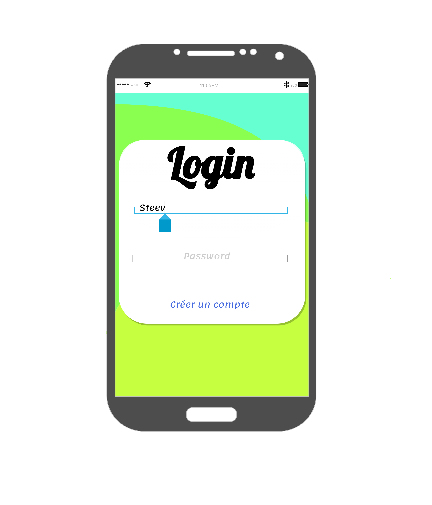
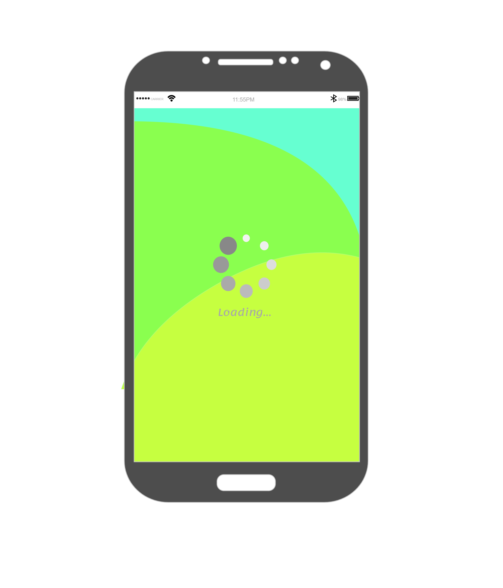
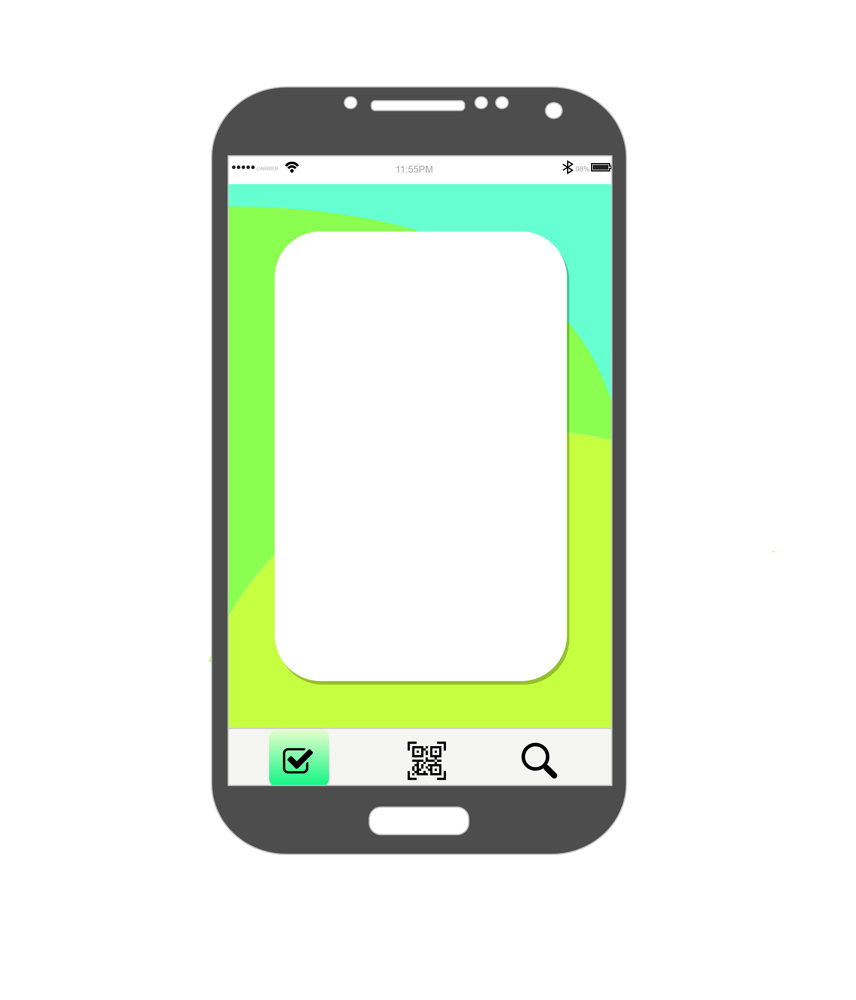
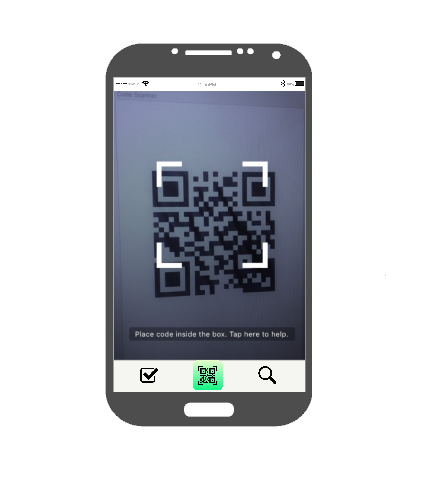

# Réunion YEP du Lundi 19 Octobre 2020 :

#### Personnes présentes :

- William Gathoye
- Thomas Beck
- Lise Laurent
- Gary Georges
- Belen Fernandes

#### Absence : 

- Romain Van Geit
- Gaël Baôo
- Drilon Ibraimi

#### Durée de la réunion : 26 minutes 40 secondes

#### Sujets abordés :

- Frigo virtuel :
  - Ajouter des catégories de liste d'aliments (Possibilité de créer sa propre catégorie)
  - Autoriser les émoticônes Android comme nom de catégorie dans le texte (émoticônes présentes dans la wishlist).

- Liste de course :
  - Présence d'une liste à deux niveaux : 
    1. Les catégories (nom pouvant être un émoticône)
    2. Les aliments de cette catégorie (nom pouvant être un émoticône)
- Remarques générales :
  - Autoriser émoticônes dans le nom des aliments (Rajouter image poires pommes).
  - Les clients veulent qu'on continue dans la simplicité -> pas trop de boutons ou de menus.
- A faire :
  - [ ] Intégrer les modifications dans les wireframes.
  - [ ] Terminer la conversion des calques GIMP en MarvelApp
  - [ ] Fournir le lien du MarvelApp aux clients afin de leur permettre de tester l'application et donner des retours.
  - [ ] Ranger les documents administratifs et les rendre disponibles à tout un chacun.
- Mockups :

