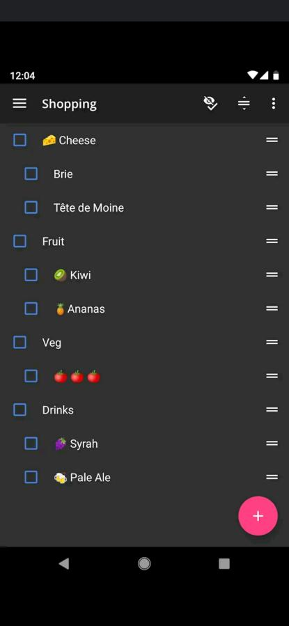
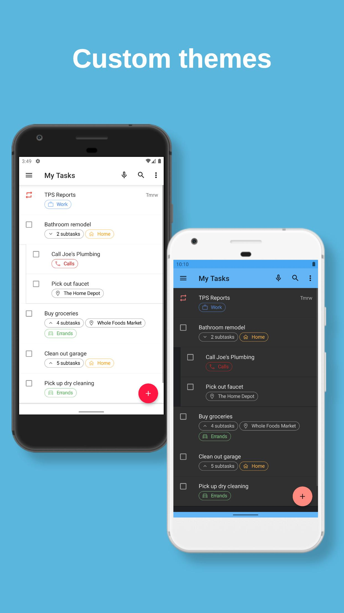

# Meeting technique du 2020-11-16

Durée de la réunion : 1h

## Personnes présentes

* William Gathoye 
* Thomas Beck 
* Romain Van Geit

## Absences
* N/A (idéalement les clients)

## Objet

Second meeting l’app et resynchronisation d'équipe.

## Sujets abordés

* Présentation des nouveaux wireframes mis à jour
* Simple démo des tests Android
    * Implémentation de l’activité du frigo et de la librairie tierce en charge
      du scanning du QR code.
    * Système de notifications à peaufiner. Sans push pour l’instant.
    * Conversion de la librairie de l’action bar de Kotlin vers Java.
    * Utilisation d’une pastille de notification sur l’icône du frigo.
* Les doubles listes sont possibles. Reverse d’une app existante pour en
  comprendre son fonctionnement et son implémentation.
  
  Ici aCalendar+, application payante disponible et disponible sur le Play
  Store. ACalendar est l'alternative européenne la plus prisée en terme de
  gestion de calendrier et tâches avancée et la seule compatible avec les
  standards de synchronisation CalDAV et WebDAV.

  
      
  L'application open source [Tasks (disponible sur
  F-Droid)](https://f-droid.org/en/packages/org.tasks) dispose également de
  nested lists. Le code est intéressant, mais étant de licence GPL, ça implique
  que notre code le soit également.

  
