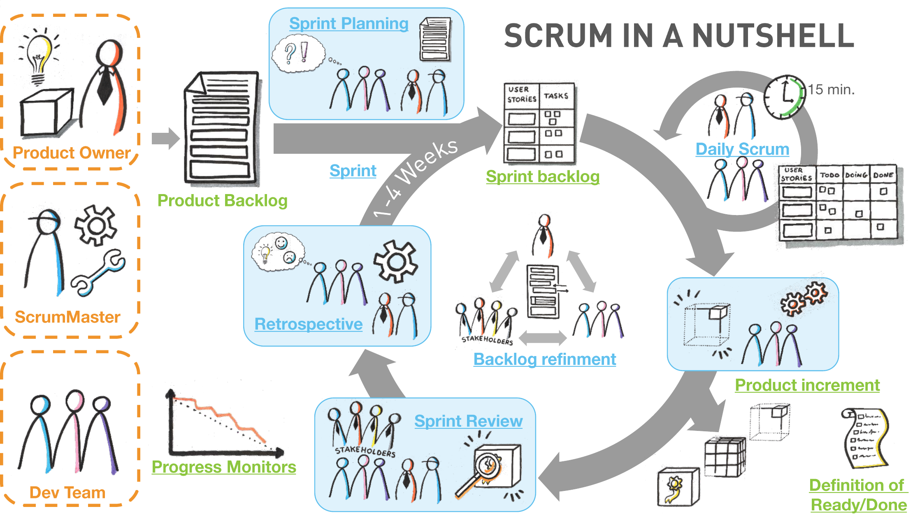
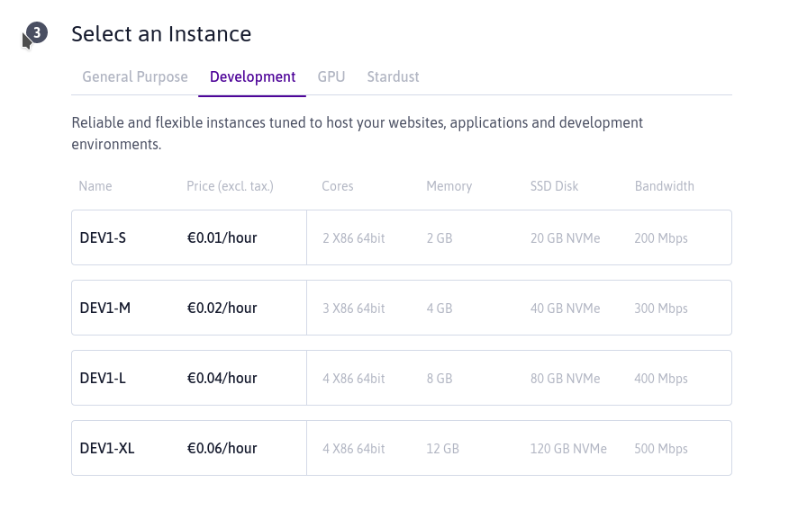
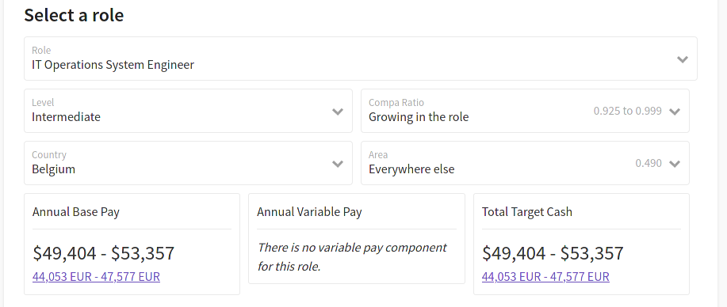

# Réunion YEP du 2020-11-23

## Personnes présentes :

* Gaël Baôo <gael.baoo [at] student.hepl.be>
* Thomas Beck <thomas.beck [at] student.hepl.be>
* Ibraimi Drilon <drilon.ibraimi [at] student.hepl.be>
* Lise Laurent <lise.laurent [at] student.hepl.be>
* Hafsa Ouazri <lise.laurent [at] student.hepl.be>
* Sonia Gazali <sonia.gazali [at] student.hepl.be>
* William Gathoye <william.gathoye [at] student.hepl.be>
* Gary Georges <gary.georges [at] student.hepl.be>
* Belen Fernandes <belen.fernandes [at] student.hepl.be>
* Axelle Hermans <axelle.hermans1 [at] student.hepl.be>
* Romain Van Geit <romain.vangeit [at] student.hepl.be>

Note : Par rapport aux autres réunions, les étudiants en comptabilité ont été rajoutés au projet YEP et ont dès lors décidé de participer à cette réunion.

## Absences

* N/A

## Durée de la réunion : 01h02

## Objet : Démonstration des changements opérés sur l’app (scrum review)

### Démonstration de l'état d'avancement

* Les wireframes mis à jour sont remontrés, utile vu qu'une partie de l'équipe n'était pas présente et vient de nous rejoindre.

* Faute de temps, les mockups n'ont pas été mis à jour, comme l'application ets déjà bien avancée, on montre les changements directement via le designer d'interface d'Android Studio.

* Certains utilisateurs d'iOS se demandent si l'application pourra être disponible pour leur système d'exploitation. Nous reprécisons le pourquoi du choix d'Android uniquement pour l'instant (part de marché importante).

### Base de données impossible

* Dans le cadre d'une journée séminaire organisée dans la section commerce extérieur, la partie cliente a eu l'occasion de rencontrer des professionnels du secteur de l’entreprenariat et des ingénieurs (pour la partie technique).

* De ce meeting, et à l'instar de ce que la partie technique de ce projet avait déjà alerté, il est ressorti que la construction de la base de données comprenant le lien entre produit et date de péremption est utopiste. Ce point nécessite en effet la participation active de tous les acteurs des chaînes de magasins de distribution.

* En comparaison, le Nutriscore pourtant porté par une directive Européenne a pris du temps à s'implanter, de surcroît en Belgique, un petit marché qui comprend de nombreuses restrictions notamment en termes de packaging FR/NL (et donc de coût pour une marque qui souhaiterait s'y développer). Il est dès lors compliqué de vendre une application qui tiendrait compte de l'existence de cette base de données.

* Ni les acteurs de la distribution, ni les marques n'y ont quelque chose à gagner, pire elle pourrait avoir une influence négative sur le chiffre d'affaires.

    * Coût de développement pour permettre au système de caisse actuel de générer un QR code menant vers un ticket virtuel ;

    * 2 mêmes produits disposant du même code barre peuvent avoir des dates de péremption différente. Il est dès lors utile pour la chaîne de distribution de rajouter un autre code barre sur l'étiquette pour pouvoir scanner cette date de péremption plus rapidement. D'après les infos glanées durant le séminaire, il serait plus facile de travailler avec Delhaize et Colruyt qui sont déjà bien avancés à cet égard.
    
### Scanning en 2 étapes

* La solution serait alors de scanner la date de péremption en plus du code barre et ce, pour chaque produit. En lieu et place du QR code en fin de ticket de caisse symbolisant une URL menant vers un ticket de caisse virtuel, il serait alors question d'avoir 2 photos par produit : le scan du code barre et le scan de sa date de péremption. Ce nouvel aspect représente un frein non négligeable à prendre en compte au niveau marketing vu la perte de l'avantage précédemment mis en avant : la rapidité d'utilisation de l'application au quotidien par le grand public.

* Il n'est donc plus question du simple scan d'un code QR, mais de l'ajout de la reconnaissance d'une photo comprenant une chaîne de caractères à interpréter sous forme de date, d'autant plus difficile s'il faut tenir compte des multiples formats qu'il existe : YYYY-MM-DD, MM/YY, MM/YYYY, etc. En effet, la norme ISO 8601 (YYYY-MM-DD) est loin d’être respectée.

* La partie technique fonctionnant en méthode agile (SCRUM) va tenter une nouvelle fois de rencontrer les attentes du client sur cette partie en modifiant le prototype d'application. Cependant, vu les contraintes de temps imposées, l'engagement sera alors en « best effort » (sans garantie donc), ce revirement intervenant alors que le projet touche déjà à sa fin. La partie de scan d'image nécessitant des fonctionnalités d'interprétation d'image avancée (ex.: OpenCV) et potentiellement une intelligence artificielle, le bidonnage de données sera de rigueur à moins que des APIs faciles à implémenter permettent une utilisation aisée (ex.: Cognitive API de Microsoft, payantes si le nombre d'appel d'API dépasse une certaine limite).

* L'application scanne des produits tant qu'il y en a à scanner (attention aux doublons dans le frigo).

### Logo et évolutions visuelles

* La liste de course devient optionnelle et ne se centre plus exclusivement sur le frigo, mais s'étend à toutes les denrées périssables. Dans l'illustration de l'app, il faut mettre moins en avant les fruits et légumes, mais également donc y intégrer les poissons, la viande et les conserves.

* Le logo de l'application doit dès lors être mis à jour.

### Business model

* Le client demande un retour d'expérience de l'équipe technique au sujet du financement de l'application. L'équipe technique rappelle qu'elle n'a pas de compétences à ce sujet et qu'il relève plutôt du travail de la partie e-commerce ou comptable de trouver une solution de financement. Cependant, William, développeur dans la partie technique, partage toutefois son expérience personnelle passée en tant qu'entrepreneur ayant baigné dans un univers de startups.

* Comme évoqué dans [le rapport de réunion du 2020-10-12](2020-10-12-meeting-with-whole-team.md) dernier, plusieurs solutions de financement avaient été envisagées.

    * L'application est principalement axée sur le consommateur final (B2C), il n'est pas question de le faire payer par les particuliers, car ça représentarait un frein dans l'adoption de cette aplication.

    * Solution de financement 1 : Un profil « restaurateur (B2B) » payant à choisir au moment de la connexion à l'application permettant aux utilisateurs du secteur de la restauration de gérer leur grosse quantité de stock. Restant alors la difficulté de choisir quoi faire différer du profil normal (B2C) et quelles restrictions imposer à la partie B2B pour encourager les restaurateurs à utiliser cette partie (payante).

        * Suite à la journée séminaire, le client déclare qu'il faut conserver son objectif et ne pas s'éparpiller dans cette voie.

        * Les wireframes indiquant un lien vers la page d'accueil vers une éventuelle fonctionnalité pour restaurateur avait été envisagée. Nous allons juste laisser le lien tel quel qui mènera toujours à un popup indiquant que cette fonctionnalité fera éventuellement l'objet d'une future mise à jour. Ce popup montrera aux responsables du YEP que l'application est évolutive et que cette question a déjà été envisagée, ça ne peut qu'être mieux.

    * Solution de financement 2 : Lorsque l'application prévient l'utilisateur qu'un article va arriver à expiration, lui proposer des produits vendus par des partenaires locaux afin de favoriser les alternatives locales et bios. Cette fonctionnalité nécessite pour les propriétaires de l'application d'établir des partenariats locaux.

        * Cette démarche est plutôt coûteuse et surtout chronophage. Dans le cadre d'une entreprise, cette démarche entraînera une perte substantielle des provisions de l'entreprise notamment par le coût engendré par la personne commerciale et surtout par le peu de retours financiers obtenus (un partenariat de ce type entraînera quelques euros par mois, vu le peu d'audience que l'application aura à ses débuts) ce qui ne couvrirait même pas le coût dudit commercial ni même le coût de développement de l'application.

        * Ne pas pouvoir développer ce point est un coup dur au niveau marketing. En effet, l'application aurait pu être présentée comme un effet de levier pour les partenaires locaux, pour justement surfer sur cette tendance du local d'autant plus exacerbée par l'arrivée du COVID. Une adaptation commerciale est nécessaire voire un revirement total devrait être envisagé sur le plan communication.

        * Enfin, les acteurs locaux (surtout bios) privilégient les achats en vrac qui ne disposent donc pas de QR code, ce qui rend l'utilisation de notre application compliquée dans pareils cas.

    * Solution de financement 3 : Le modèle de l'ajout de publicités directement dans l'application a enfin, et en guise de revirement, été évoqué dans cette dernière réunion. Ce procédé offre un avantage non négligeable, car il ne nécessite pas de devoir établir des partenariats un par un ni ne nécessite que l'app soit sur les stores pour qu'on puisse commencer à démarrer le processus de commercialisation (en effet, dans le cadre de partenariats, les candidats partenaires attendent généralement de voir comment l'application se comporte sur les stores en termes de visibilité avant de se décider à conclure un partenariat).

        * Avec une solution comme Google AdMob, le développeur de l'application puise parmi un vivier de publicités déjà existantes sur cette plateforme. Il est même possible de choisir le secteur d'activité des publicités intégrées. On ne risque dès lors pas de recevoir de la publicité relative aux voitures dans une application dédiée aux aliments. Cependant restreindre les publicités à certaines catégories influence très négativement le potentiel revenu. Notons qu'à l'instar de Youtube, et en fonction des préférences de l'utilisateur, il se peut que Google envoie en lieu et place de la publicité ciblée dans le cas où il n'existe pas de correspondance entre le profil de l'utilisateur et le contenu de notre application. Dans ce cas, si l'utilisateur qui fait ses courses est un amateur de voitures, il se peut quand même qu'il reçoive des publicités relatives à un carburateur par exemple.

        * Une bannière de publicité affichée à l'instar d'une vidéo que l'on pourrait passer après un certain temps, vidéo qui prendrait toute la largeur de l'application rapporterait plus mais serait à nouveau contre l'argument de la rapidité. Ça dépend bien évidemment du moment où cette vidéo sera affichée.

        * Notons que le modèle de la publicité représente souvent la solution basique de dernier recours lorsque d'autres stratégies (peut-être plus éthiques) n'ont pas fonctionné. Les utilisateurs n'apprécient pas tellement, car cette solution (simpliste) va à l'encontre de la rapidité et (souvent) du respect des données personnelles. Avec l'arrivée du Règlement général sur la protection des données (RGPD) et du California Consumer Privacy Act (CCPA), les utilisateurs commencent à prendre conscience de cette problématique. L'abus de certaines plateforme a conduit un grand nombre d'utilisateur à installer des bloqueurs de publicités (même si sur mobile il reste plus difficile d'en installer un, mais pas impossible).

        * Notons également que le coût par clic diminuant sans cesse d'année en année, il est de plus en plus difficile pour un créateur d'application de pouvoir vivre de sa création. Pour masquer cette diminution de revenu potentiel pour les intégrateurs de publicité, les chiffres évoqués sur [la page du programme AdMob](https://admob.google.com/home/resources/how-much-revenue-can-you-earn-from-admob/) datent d'ailleurs de 2013 ou de 2016, une époque où les couts par clic étaient bien plus élevés qu'actuellement. Ces chiffres ne représentent donc plus la réalité. ex.: 2000 USD par jour pour une application sont évoqués. Lorsqu'on regarde le nombre de téléchargements réalisés par l'[ensemble des apps de l'éditeur](https://play.google.com/store/apps/developer?id=Balloon%20Island&hl=en) (plus de 2 millions), on se rend compte que ce n'est pas aisé d'atteindre pareil niveau. Ce genre d'application fournit de la publicité intrusive sur laquelle l'utilisateur est souvent obligé de cliquer pour recevoir des points additionnels dans son jeu pour jouer sur sa dépendance (vu que l'utilisateur est accro, recevoir des points en plus joue sur [son système de récompense](https://fr.wikipedia.org/wiki/Syst%C3%A8me_de_r%C3%A9compenshttps://fr.wikipedia.org/wiki/Syst%C3%A8me_de_r%C3%A9compensee)). Pareille app offre donc une estimation biaisée de ce qu'un développeur obtiendra en fin de mois. Notre application n'engendrant pas de dépendance au point de devenir accro, ces chiffres ne sont d'autant pas applicables dans notre cas.

        * En guise de comparaison, l'application ProchainBus (désormais nommée NextRide) développée par Thomas Hermine et son équipe ne captait que quelques centaines d'EUR par mois, tout juste de quoi payer le coût de l'application (serveurs, certificats, mise en place sur les stores mobiles). Et ceci, alors qu'un partenariat privilégié avait été signé avec Mobistar (maintenant Orange). Il n'était donc pas question de faire appel à AdMob ici (qui d'ailleurs se sucre au passage, vu qu'il s'agit d'une régie publicitaire).

        * Au niveau technique, cette bannière souvent qualifiée de GIF est en réalité un fichier vidéo, vidéo car elle peut tirer parti de l'accélération matérielle de l'appareil. Parler de .gif est donc un abus de langage.

    * Solution de financement 4 : le label publicitaire. Certaines enseignes de la distribution veulent en effet surfer sur le label du manger mieux (Carrefour et Delhaize). L'application pourrait alors devenir un kiosk pour ces marques, mais reviendrait à ce que l'application soit rachetée ou pire, vu le développement technologique de Delhaize, que le projet soit entièrement copié sans aucune contre-partie.

    * Solution 5 : l'appel au crowdfunding.

        * Variante A : Simplement pour le démarrage de l'application, l'argent récolté permettrait le paiement des développeurs. Les early-adopters s’attendront alors à avoir une contre partie (ex.: si un futur abonnement est produit, quelque chose gratuit de par le futur). Cette stratégie doit cependant s'assurer que le nouveau business model est prêt et ne pas se dire que ce sera l'objet d'une décision ultérieure. L'investisseur potentiel doit être convaincue d'emblée par le business model.

        * Variante B : En faire un [commun numérique](https://fr.wikipedia.org/wiki/Biens_communs_num%C3%A9riques). Si le crowdfunding réussit mais que le business model est bancal au point où les investisseurs semblent avoir été floués (c'est parfois le cas si l'entreprise se développe et devient de plus en plus mercantile sans pour les early adopters d'obtenir une contre partie). Placer l'application en [open-source](https://fr.wikipedia.org/wiki/Open_source) serait alors nécessaire, quitte à ce que ce projet devienne un commun numérique. Le crowdfunding serait alors un moyen de payer des développeurs pour la mise en place de la solution, un peu comme de la consultance et le projet d'entreprise s'arrête là, sans perspective à moins que d'autres personnes se basant sur cette application décident de continuer son développement. Il sera alors important de choisir une [licence](https://choosealicense.com/) empêchant que le produit ne tombe et ne devienne privé (GPL/MPL en lieu et place d'une licence Apache ou MIT).

    * N'oublions pas qu'avant de gagner le moindre argent, il faut récupérer son investissement à savoir le coût de développement de pareille application, un coût non négligeable, comme nous allons le voir.

### Coût de développement

Note : Cette section a été ajoutée suite aux questions du client intervenues après la réunion.

* Quelles sont les étapes de la création d'une telle application qui vont être facturées, à combien les estimons-nous ? (logiciel, etc).

    * Le coût va tout d'abord dépendre de quoi on part. Si le client a déjà une idée précise avec un logo, un business model clair, et s'étend déjà renseigné sur les interfaces graphiques possibles avec juste quelques raffinements nécessaires, il va de soi que le projet sera bien moins cher qu'un projet où l'entreprise doit accompagner le client et le conseiller (« time is money ») et effectuer de la gestion de projet.

    * Les étapes de la création d'un tel projet :

        * En tant qu'entreprise on détermine si le [lead](https://fr.wiktionary.org/wiki/lead) a des chances d'aboutir ou non. Ceci passe par le fait de savoir combien le client est prêt à mettre sur le table. Si le client n'a pas une idée, on lui répond dans les grandes lignes de façon à ce qu'il puisse mieux savoir si ça rentre dans son budget ou pas. Si le client pensait que c'était bien moins cher, dans ce cas, le projet tombe à l'eau ou on l'accompagne pour les premières étapes (c'est le cas d'entreprises qui n'ont pas uniquement des développeurs dans l'équipe, mais ont des développeurs commerciaux/business angels, etc. qui ont une certaine expérience dans la fondation d'entreprises).

        * On établit ensuite les axes prioritaires (typiquement les fonctionnalités à développer) pour caler dans le budget .

        * Viennent ensuite [wireframes et mockups](./2020-10-06-meeting-with-thomas.md#maquettes) qui s'accompagnent généralement d'un logo et d'une charte graphique. Cette charte graphique est importante pour le développement de l'application (si la marque a une image carrée, on ne va pas faire des boutons ronds, etc.).

        * Une landing page (un site web temporaire annoncant le projet) est également recommandé ainsi qu'une présence sur les réseaux sociaux afin d'accueillir les premières impressions et constituer une base d'utilisateurs qui seraient ainsi intéressés pour tester l'application en primeur par exemple.

        * Selon la méthode agile SCRUM qui se base sur des cycles de développement, idéalement sur 15 jours (c'est la méthode qu'on a choisie dans le cadre de ce projet) : on fournit des livrables rapidement au client de façon pour lui à nous faire ses retours tôt dans le processus de création, nous permettant ainsi d'ajuster le tir si la direction prise par le développement est incorrecte ou si en cours de route, on se rend compte que le business model ne tient pas et nécessite des ajustements (ça arrive malheureusement encore trop souvent). Cette méthode agile est aventageuse dans le sens où le client ne doit pas attendre la toute fin du projet pour pouvoir avoir une impression de ce que donne son projet.

            

        * Un site web évoque des pistes d'estimation :
            * https://www.mobizel.com/prix-combien-coute-une-application-mobile/
            * https://www.mobizel.com/combien-coute-une-application-comme-uber/

        * Ces estimations sont tout à fait correctes, si Thomas, Romain et William avaient dû être payés pour le temps passé, c'est le prix qui aurait été demandé, sachant qu'ici fatalement on ne développe pas des applications tous les jours et qu'on est toujours considérés comme étant en formation, ça nous prend logiquement plus de temps que dans une entreprise où on réalise ce projet du matin à la fin de journée.

        * Tenant compte du temps passé par l'équipe technique pour rencontrer les attentes des clients, effectuer du projet management, étudier avec eux les possibilités de monétisation, et si cette équipe technique avait disposé de designers ou d'experts en UI/UX dans l'équipe, tous les éléments précités auraient fait monter la note à 14 000 EUR pour un projet terminé avec un backend développé. Seule l'application native Android aurait été développée, iOS nécessite encore un autre devis. Il est en effet plus compliué de développer sur iOS d'entrée de jeu, vu qu'il est nécessaire d'avoir un ordinateur Mac disposant des dernières versions de XCode et de macOS.

        * Notons que dans la réalité ce prix va également dépendre de 2 facteurs : le type d'entreprise et le type de tarification.

            * Type d'entreprise : suivant qu'on fasse appel à une entreprise disposant d'employés ou des consultants, le prix est amené à changer. Un employé est payé aux alentours des 15 EUR de l'heure là où un consultant est amené à tarifer à partir de 40 EUR / h (moyennes personnelles établies par William, dans un écosystème belge - Liège).

            * Type de contrat :
            
                * « [Fixed-cost contract](https://en.wikipedia.org/wiki/Fixed-price_contract) » : un contrat qui ne dépend pas des resources et du temps alloués par l'entreprise. Le client a demandé une fonctionnalité et la veut pour telle date. C'est à charge de l'entreprise de mettre tout en oeuvre pour y arriver. Le risque étant porté sur l'entreprise, ce type de contrat est généralement plus cher.

                * « [« T&M » pour « Time and materials »](https://en.wikipedia.org/wiki/Time_and_materials) : l'entreprise estime du mieux possible le temps nécessaire et le client paie le temps passé. Il n'y a pas de garantie que le projet soit livré dans les temps estimés. Comme le risque est alors déporté sur le client, ce type de contrat est alors moins cher de l'ordre de 20 à 25 % par rapport à un « fixed cost contract ». C'est généralement ce type de contract qui est utilisé dans [le cas du consulting ou du support de L3](https://www.collaboraoffice.com/fr/conseil/).

* A combien estimons-nous la commercialisation de l'application ? (App store et/ou Play Store)? Est-ce qu'une maintenance de l'application est nécessaire toute l'année ou sur certaines périodes ? Et à combien cela s'élèverait ?

    * Outre le coût de l'application, pour la partie backend, il est nécessaire d'avoir un serveur. Le prix de ce dernier dépend de la charge d'utilisateurs qui seront connectés. Il est important donc d'avoir un bon « sizing » dès le départ. Ici un serveur d'« entrée de gamme » est suffisant. Voici des exemples de prix chez Scaleway, un fournisseur cloud français bien connu. Pour compter large : 25 EUR / mois.

        

    * Pour publier une publication sur le Play Store de Google : 25 EUR, une fois.

    * Pour publier une publication sur l'App Store d'Apple : 99 EUR / an.

    * La plupart du temps, il faut un certificat pour [signer les applications sur les stores](https://developers.mattermost.com/contribute/desktop/code-signing/), mais maintenant, il ne faut plus acheter de certificat, ils sont disponibles gratuitement via le prix payé pour l'accès au Google Play Store ou à l'Apple App Store.

* Quel est le salaire d'un développeur ?

    * Tout va dépendre de son expérience, mais aussi et surtout de la technologie qu'il maîtrise : si c'est un marché de niche, il vaudra plus sur le marché qu'une compétence tout venant. Toutefois, on peut estimer qu'en sortant de la HEPL, un développeur peut admettre un salaire de 1 900 EUR net sans trop de travail de négociation, pour autant qu'il ne se soit pas limité à ce qui a été enseigné à la HEPL et possède des connaissances étendues.

    * [GitLab](https://fr.wikipedia.org/wiki/GitLab), entreprise fournissant un logiciel libre de [forge](https://fr.wikipedia.org/wiki/Forge_(informatique)) éponyme, disposait autrefois d'un [calculateur public](https://about.gitlab.com/handbook/total-rewards/compensation/compensation-calculator/calculator/), mais celui-ci a été rendu privé il y a peu. Heureusement, [ce calculateur a été sauvé sur la web archive](https://web.archive.org/web/20200606161551/https://about.gitlab.com/handbook/total-rewards/compensation/compensation-calculator/calculator/). Nous avons pu nous procurrer l'estimation qu'une telle entreprise s'attend d'un développeur belge. Notons que l'outil permet de régler différents paramètres :
        * un niveau « level » : « junior », « intermediate » ou « senior ». En sortant de la HEPL, un étudiant est considéré entre « junior » et « intermediate ».
        * un niveau d'apprentissage pour la tâche dans laquelle on vient d'être engagé « compa ratio range » (ex.: pour une tâche qui nécessite une certaine adaptation, quand on vient d'arriver on ne peut pas prétendre au même salaire qu'une personne qui a 2 mois d'expérience sur un processus interne de l'entreprise)
        * mais également une localisation au sein du pays visé (un développeur bruxellois coûtera plus cher qu’un développeur liégeois).

      

    * Comme on le voit sur cette image, une moyenne basse implique : 44 053 EUR par an brut. Si on part du principe qu'entre le net et le brut il y a pratiquement 50 % de différence, les 1 900 EUR / mois nets sont facilement atteints.

### Focus

Dans l'état actuel, vu que le produit n'est pas exploitable sur le marché directement, on part sur un produit fictif, il est dès lors important de se concentrer sur les 2 plus-values :
* le QR code et l'encodage des dates
* la liste de course

### Calendrier

* Présenter le livrable 1 le plus vite possible au client
* Exporter les mockups (export vidéo du workflow de l'application) pour que les étudiants en commerce extérieur puissent les utiliser.
* Réunion dans 15 jours avant le 15 décembre.
